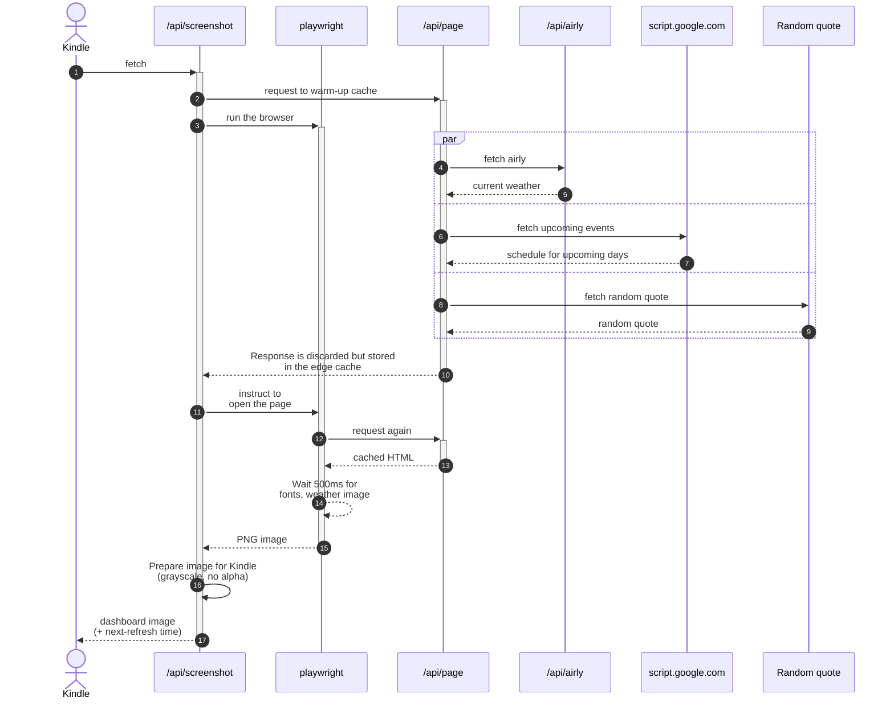

# Kindle-page

This is my home page to be shown on the Kindle as a Frame.

There is a Vercel API function that generates the PNG ready to be shown
on the Kindle device.

See related projects:

- Kindle code: https://github.com/bukowskiadam/kindle-onlinescreensaver
- Kindle fetch-file binary: https://github.com/bukowskiadam/fetch-file

## Running

1. Install `npm install`
2. Run dev mode `npm start`
3. Deploy to your app `npm run deploy`

The image is **upside-down** because my Kindle is upside-down in the picture frame.

## Application flow

